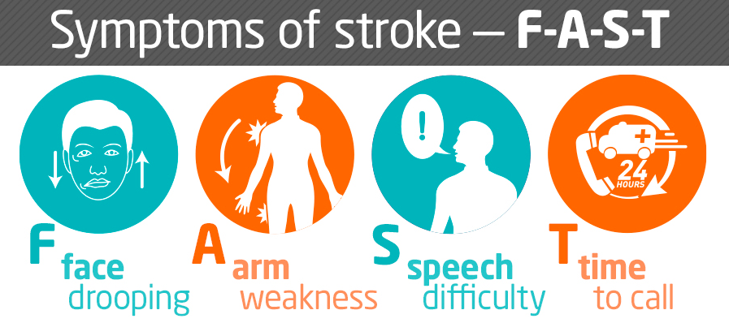

---
header-includes:
- \usepackage{graphicx}
output: pdf_document
---

```{r image harvardx, echo=FALSE, fig.align='center', out.width="25%"}

```


\definecolor{greenJoe}{RGB}{0,128,128}
\definecolor{blueJoe}{RGB}{0,0,250}
\definecolor{redJoe}{RGB}{200,0,0}


\begin{center}
\huge{ \textcolor{blueJoe}{\textbf{Stroke Report}} }
\end{center}
&nbsp;

\begin{center}  
\large{\textcolor{greenJoe}{\textbf{Ing. José Ramón Riesgo Escovar}} }
\end{center}

&nbsp;
  
\begin{center}
May 2020
\end{center}

&nbsp;
  
\begin{center}
\Large { \textcolor{blue}{\textbf{INTRODUCTION TO STROKE  } } }
\end{center}
  
&nbsp;
  
&nbsp;  
  
Stroke is one of the leading causes of death globally. Sometimes it is also called a brain attack. A stroke happens when something is blocking the blood supply to a part of the brain. Also a Stroke happens when a vessel in the brain bursts. In either case, this stops the flow of blood and due to this, part of the brain becomes damage or dies. Unfortunately when this happens it can cause lasting brain damage, long-term disability and even in some cases the death.
Our brain controls our movements, stores our memories, and it is the source of our thoughts, emotions and our language. Besides these functions also the brain controls functions like breathing and controls our digestion.

Our brain uses 20% of the oxygen we breathe and the arteries deliver our oxigen-rich blood to all the sections of our brain.

```{r image stroke, echo=FALSE, fig.align='center', out.width="50%"}

```

\begin{center}
\scriptsize {Image taken from Mayo Foundation for Medical Education and Research}
\end{center}

\begin{center}
\footnotesize {A stroke happens when a blood clot blocks blood flow to the \\ brain or when there is a bursts that prevents the flow of blood} 
\end{center}

&nbsp;

The stroke is the third major cause of disability. Long term disability affects people severely, in terms of their productive life.
The aim of this report is to identify the risk factors and with them be able to predict if someone has high risk of having a Stroke.

The patient dataset  was obtain from [**Kaggle**](https://www.kaggle.com/fedesoriano/stroke-prediction-dataset/) the process and methods to ascertain whether a variable is a risk factor will be evaluated and described. We will visualized and discovered insights of the dataset, ending with a conclusion and some ideas and suggestions for future work on the reserach for early symptons that could help prevent an actual Stroke.

From Kaggle we get the description of the columns in our dataset:

  1) id: unique identifier
  2) gender: Male, Female or Other
  3) age: age of the patient
  4) hypertension: 0 if the patient doesn't have hypertension, 1 if the patient has hypertension 
  5) heart_disease: 0 if the patient doesn't have any heart diseases, 1 if the patient has a heart disease
  6) ever_married: "No" or "Yes"
  7) work_type: "children", "Govt_jov", "Never_worked", "Private" or "Self-employed"
  8) Residence_type: "Rural" or "Urban"
  9) avg_glucose_level: average glucose level in blood
  10) bmi: body mass index
  11) smoking_status: "formerly smoked", "never smoked", "smokes" or "Unknown"*
  12) stroke: 1 if the patient had a stroke or 0 if not
    

*Note: "Unknown" in smoking_status means that the information is unavailable for this patient

In the next section we will first do a data preprocessing and then we will execute the exploratory data analysis and then work on the models.

\pagebreak

\begin{center}
\Large { \textcolor{blueJoe} {\textbf{DATA PREPROCESSING ANALYSIS:} } }
\end{center}

```{r Libraries Needed, include=FALSE}
#########################################
# LOADING ALL LIBRARIES THAT WILL BE USED
#########################################
library(tidyverse)
library(dplyr)
library(ggplot2)
library(qwraps2)
library(markdown)
library(lattice)
library(caret)
library(knitr)
library(corrplot)
library(mda)
library(arm)
#########################################
```

&nbsp;

The Dataset consists of:  

```{r Load and dimension, echo=TRUE}
stroke_data <- read.csv("stroke.csv", header = TRUE)
dim(stroke_data)
```


We have 5110 records and 12 columns, 11 potential predictors and the column that indicates if the patient got actually a stroke or not.

Now we will be exploring one by one the potential predictors:

&nbsp;

\textcolor{blueJoe}{\textbf{1) ID : Unique Identifier } }

This is a number to identify the patient but it is irrelevant because does not provide any meaningful information for our future models so we will delete this column from our datset by applying this code: 

```{r eliminate id, echo=TRUE}
stroke_data <- subset( stroke_data, select = -id )
```

&nbsp;

\textcolor{blueJoe}{\textbf{2) Gender: The specific gender of the patients } }


With the following will generate the actual distribution of the gender within the dataset:

```{r Gender distribution, echo=TRUE}
stroke_data %>%
  group_by(gender) %>%
  summarise(total = n())
```

We see that there is just one record of an "Other" gender, having just one record is insignificant to the dataset and the future predicion models so we will eliminate it from the dataset using this code:

```{r Elimiate Other, echo=TRUE}
stroke_data <- subset (stroke_data, stroke_data$gender !="Other")
```

Now the dataset has the following distribution of Gender of Patients:
  
```{r Pie chart of Gender, echo=FALSE, fig.align='center', fig.height=2, fig.width=3}
# We are going to generate a pie chart of the distribution between genders
stroke_data %>%
  group_by(gender) %>%
  summarise(total = n()) %>%
  ggplot(aes(x="", y=total, fill=gender)) +
  geom_bar(stat="identity", width=1) +
  # Use the Polar System for generating the Pie
  coord_polar("y", start=0) +
  # Define the Percentages inside the Slices
  geom_text(aes(label = paste0(round(total/nrow(stroke_data) *100), "%")),
            position = position_stack(vjust = 0.5)) +
  # Define blue colors
  scale_fill_manual(values=c("#55DDE0", "#33658A")) +
  labs(x = NULL, y = NULL, fill = NULL, title = "PATIENT GENDER DISTRIBUTION") +
  theme_classic() +
  # Make sure that there are no additional labels generated
  theme(axis.line = element_blank(),
        axis.text = element_blank(),
        axis.ticks = element_blank()) +
  # Center the title and make it Blue
  theme(plot.title = element_text(color = "#0099FF", size = 8, 
                                  face = "bold", hjust = 0.5))
```

&nbsp;

\textcolor{blueJoe}{\textbf{3) Age: Distribution of the age of the patients } }

&nbsp;

Generating the summary of how the age is distributed within our patients

```{r Summary of Age, echo=TRUE}
  summary(stroke_data$age)
```

The next chart shows how the patients are distribute by grouping them in ranges of 10 years of age

```{r Distribution of Age, echo=FALSE, fig.align='center', fig.height=2, fig.width=3}
stroke_data %>%
  mutate(cuts = cut(age, seq(from = 0, to = 100, by = 10))) %>% 
  group_by(cuts) %>%
  summarise(total = n()) %>%
  ggplot(aes(x=cuts,y=total)) +
  geom_bar(stat= "identity", fill = "#00AAFF") +
  scale_fill_gradient() +
  labs(title = " DISTRIBUTION OF AGE OF PATIENTS") +
  xlab("GROUP BY RANGE OF 10 YEARS") + 
  ylab("NUMBER OF PATIENTS WITHIN RANGE") +
  theme(plot.title = element_text(color = "#0066FF", size = 8, 
                                  face = "bold", hjust = 0.5)) +
  theme(axis.title.x = element_text(color = "#777777", size = 7, 
                                    face = "bold", hjust = 0.5)) +
  theme(axis.title.y = element_text(color = "#777777", size = 7, 
                                    face = "bold", hjust = 0.5)) +
  theme(axis.text.x = element_text(color = "#0000FF", size = 7, 
                                   face = "bold", hjust = 0.5, angle = 90)) +
  theme(axis.text.y = element_text(color = "#0000FF", size = 7, 
                                   face = "bold", hjust = 0.5)) 
```

With the following BoxPlot we can see very clear that there is a tendency for older patient to have a Stroke:

```{r BoxPlot Age vs Status, echo=FALSE, fig.height=2, fig.width=3, fig.align='center'}
stroke_data %>%
  mutate(text = ifelse(stroke==0,"Healthy","Stroke")) %>%
  ggplot(aes(x = text, y = age)) +
  geom_boxplot(fill=c("#FF0000","#44FFFF"), colour= "#0000FF") +
  scale_y_continuous(name = "Patients Age") +
  scale_x_discrete(name = "Patients Status") +
  ggtitle("PATIENTS") +
  theme(plot.title = element_text(color = "#0066FF", size = 13, 
                                  face = "bold", hjust = 0.5)) +
  theme(axis.title.x = element_text(color = "#777777", size = 11, 
                                    face = "bold", hjust = 0.5)) +
  theme(axis.title.y = element_text(color = "#777777", size = 11, 
                                    face = "bold", hjust = 0.5)) +
  theme(axis.text.x = element_text(color = "#0000FF", size = 7, 
                                   face = "bold", hjust = 0.5)) +
  theme(axis.text.y = element_text(color = "#0000FF", size = 7, 
                                   face = "bold", hjust = 0.5)) 
```


&nbsp;

\textcolor{blueJoe}{\textbf{4) Hypertension: Information if the patient had hypertension or not } }


With the following code we visualized the total patients that have hypertension and the ones without hypertension

```{r Distribution Hypertension, echo=TRUE}
stroke_data %>%
  mutate(text = ifelse(hypertension==0,"Without Hypertension","With Hypertension")) %>%
  group_by(text) %>%
  summarise(total = n())
```

Showing in a pie chart the hypertension distribution within our set:

```{r Chart of Hypertension, echo=FALSE, fig.align='center', fig.height=2, fig.width=3}
stroke_data %>%
  mutate(text = ifelse(hypertension==0,"Without Hypertension","With Hypertension")) %>%
  group_by(text) %>%
  summarise(total = n()) %>%
  ggplot(aes(x="", y=total, fill=text)) +
  geom_bar(stat="identity", width=1) +
  # Use the Polar System for generating the Pie
  coord_polar("y", start=0) +
  # Define the Percentages inside the Slices
  geom_text(aes(label = paste0(round(total/nrow(stroke_data) *100), "%")),
            position = position_stack(vjust = 0.5), size= 3) +
  # Define blue colors
  scale_fill_manual(values=c("#55AAE0", "#3365FF")) +
  labs(x = NULL, y = NULL, fill = NULL, title = "PATIENT HYPERTENSION DISTRIBUTION") +
  theme_classic() +
  # Make sure that there are no additional labels generated
  theme(axis.line = element_blank(),
        axis.text = element_blank(),
        axis.ticks = element_blank()) +
  # Center the title and make it Blue
  theme(plot.title = element_text(color = "#0099FF", size = 8, 
                                  face = "bold", hjust = 0.5))
```

&nbsp;

\textcolor{blueJoe}{\textbf{5) Heart Disease: Information if the patient had a problem in his heart or not } }

&nbsp;


With the following code we visualized the total patients that have heart problems and the ones without any problem in their heart

```{r Distribution of Heart Problem, echo=TRUE}
stroke_data %>%
  mutate(text = ifelse(heart_disease==0,"Without Heart Problem","With Heart Problem")) %>%
  group_by(text) %>%
  summarise(total = n())
```

The following pie chart shows the distribution of the patients with problems in their heart:

&nbsp;

```{r Chart of Heart Problems, echo=FALSE, fig.align='center', fig.height=2, fig.width=3}
stroke_data %>%
  mutate(text = ifelse(heart_disease==0,"Without Heart Problem","With Heart Problem")) %>%
  group_by(text) %>%
  summarise(total = n()) %>%
  ggplot(aes(x="", y=total, fill=text)) +
  geom_bar(stat="identity", width=1) +
  # Use the Polar System for generating the Pie
  coord_polar("y", start=0) +
  # Define the Percentages inside the Slices
  geom_text(aes(label = paste0(round(total/nrow(stroke_data) *100), "%")),
            position = position_stack(vjust = 0.5), color = "#000000", size=3) +
  # Define blue colors
  scale_fill_manual(values=c("#55AAE0", "#3365FF")) +
  labs(x = NULL, y = NULL, fill = NULL, title = "PATIENT HEART DISEASE DISTRIBUTION") +
  theme_classic() +
  # Make sure that there are no additional labels generated
  theme(axis.line = element_blank(),
        axis.text = element_blank(),
        axis.ticks = element_blank()) +
  # Center the title and make it Blue
  theme(plot.title = element_text(color = "#0099FF", size = 7, 
                                  face = "bold", hjust = 0.5))
```


&nbsp;

\textcolor{blueJoe}{\textbf{6) ever\_married: Information if the patient had been married or not } }


With the following code we are able to visualize how many patients were married and how many were never married:

```{r Number of married patients, echo=TRUE}
stroke_data %>%
  mutate(text = ifelse(ever_married=="Yes","Married","Not Married")) %>%
  group_by(text) %>%
  summarise(total = n())
```

The following pie chart shows the distribution of the Patients that were Married against the ones that were never married:

```{r Pie Chart of Married, echo=FALSE, fig.align='center', fig.height=2, fig.width=3}
stroke_data %>%
  mutate(text = ifelse(ever_married=="Yes","Married","Not Married")) %>%
  group_by(text) %>%
  summarise(total = n()) %>%
  ggplot(aes(x="", y=total, fill=text)) +
  geom_bar(stat="identity", width=1) +
  # Use the Polar System for generating the Pie
  coord_polar("y", start=0) +
  # Define the Percentages inside the Slices
  geom_text(aes(label = paste0(round(total/nrow(stroke_data) *100), "%")),
            position = position_stack(vjust = 0.5), color = "#000000") +
  # Define blue colors
  scale_fill_manual(values=c("#55AAE0", "#3365FF")) +
  labs(x = NULL, y = NULL, fill = NULL, title = "PATIENT MARRIED DISTRIBUTION") +
  theme_classic() +
  # Make sure that there are no additional labels generated
  theme(axis.line = element_blank(),
        axis.text = element_blank(),
        axis.ticks = element_blank()) +
  # Center the title and make it Blue
  theme(plot.title = element_text(color = "#0099FF", size = 7, 
                                  face = "bold", hjust = 0.5))
```

&nbsp;

\textcolor{blueJoe}{\textbf{7) work\_type: We will show the information if the patient have work and what type of work } }

With the following code shows the amount of the patients by their work situation unless they are children:

```{r Work  type distribution, echo=TRUE}
stroke_data %>%
  group_by(work_type) %>%
  summarise(total = n())
```

With the following code we will show a pie chart with the work distribution of the patients:

```{r Chart Distribution work type, echo=FALSE, fig.align='center', fig.height=2, fig.width=3}
stroke_data %>%
  group_by(work_type) %>%
  summarise(total = n()) %>%
  ggplot(aes(x="", y=total, fill=work_type)) +
  geom_bar(stat="identity", width=1) +
  # Use the Polar System for generating the Pie
  coord_polar("y", start=0) +
  # Define the Percentages inside the Slices
  geom_text(aes(label = paste0(round(total/nrow(stroke_data) *100,digits = 1), "%")),
            position = position_stack(vjust = 0.5), color = "#FFFFFF", size= 2) +
  # Define blue colors
  scale_fill_manual(values=c("#55AAE0", "#3365FF", "#FFAAFF", "#3322AA", "#11FFAA")) +
  labs(x = NULL, y = NULL, fill = NULL, title = "PATIENT WORK DISTRIBUTION") +
  theme_classic() +
  # Make sure that there are no additional labels generated
  theme(axis.line = element_blank(),
        axis.text = element_blank(),
        axis.ticks = element_blank()) +
  # Center the title and make it Blue
  theme(plot.title = element_text(color = "#0099FF", size = 7, 
                                  face = "bold", hjust = 0.5))
```

&nbsp;

\textcolor{blueJoe}{\textbf{8) Residence\_type: defines where the patients life in urban area or rural area } }
 

With the following code summarizes where patients residence is:

```{r Distribution of Residence, echo=TRUE}
stroke_data %>%
  group_by(Residence_type) %>%
  summarise(total = n())
```

The following is a pie chart showing the distribution of the patients residence:

```{r Pie Chart of residence, echo=FALSE, fig.align='center', fig.height=2, fig.width=3}
stroke_data %>%
  group_by(Residence_type) %>%
  summarise(total = n()) %>%
  ggplot(aes(x="", y=total, fill=Residence_type)) +
  geom_bar(stat="identity", width=1) +
  # Use the Polar System for generating the Pie
  coord_polar("y", start=0) +
  # Define the Percentages inside the Slices
  geom_text(aes(label = paste0(round(total/nrow(stroke_data) *100), "%")),
            position = position_stack(vjust = 0.5), color = "#FFFFFF") +
  # Define blue colors
  scale_fill_manual(values=c("#55AAE0", "#3365FF")) +
  labs(x = NULL, y = NULL, fill = NULL, title = "PATIENT RESIDENCE DISTRIBUTION") +
  theme_classic() +
  # Make sure that there are no additional labels generated
  theme(axis.line = element_blank(),
        axis.text = element_blank(),
        axis.ticks = element_blank()) +
  # Center the title and make it Blue
  theme(plot.title = element_text(color = "#0099FF", size = 7, 
                                  face = "bold", hjust = 0.5))
```

&nbsp;

\textcolor{blueJoe}{\textbf{9) avg\_glucose\_level: defines the glucose levels of the patients in the set } }

With the following code we generate the summary of of the statistics of the average glucose level with the dataset: 

```{r Summary of aveage glucose level, echo=TRUE}
summary(stroke_data$avg_glucose_level)
```

&nbsp;

The following chart shows the distribution in ranges from the lower limit to the higher limit with increments of 10 units:

```{r Chart distibution of glucose, echo=FALSE, fig.align='center', fig.height=2, fig.width=3}
stroke_data %>%
  mutate(cuts = cut(avg_glucose_level, seq(from = 50, to = 280, by = 10))) %>% 
  group_by(cuts) %>%
  summarise(total = n()) %>%
  ggplot(aes(x=cuts,y=total)) +
  geom_bar(stat= "identity", fill = "#00AAFF") +
  scale_fill_gradient() +
  labs(title = " DISTRIBUTION OF AVERAGE GLUCOSE LEVELS") +
  xlab("GROUP BY RANGE OF 10 LEVELES") + 
  ylab("NUMBER OF PATIENTS WITHIN RANGE") +
  theme(plot.title = element_text(color = "#0066FF", size = 8, 
                                  face = "bold", hjust = 0.5)) +
  theme(axis.title.x = element_text(color = "#777777", size = 7, 
                                    face = "bold", hjust = 0.5)) +
  theme(axis.title.y = element_text(color = "#777777", size = 7, 
                                    face = "bold", hjust = 0.5)) +
  theme(axis.text.x = element_text(color = "#0000FF", size = 7, 
                                   face = "bold", hjust = 0.5, angle = 90)) +
  theme(axis.text.y = element_text(color = "#0000FF", size = 7, 
                                   face = "bold", hjust = 0.5)) 
```

We show a box plot of the patients that had a stroke as well as the ones healthy:

```{r Boxplot of Glucose, echo=FALSE, fig.height=2, fig.width=3, fig.align='center'}
stroke_data %>%
  mutate(text = ifelse(stroke==0,"Healthy","Stroke")) %>%
  ggplot(aes(x = text, y = avg_glucose_level)) +
  geom_boxplot(fill=c("#FF0000","#44FFFF"), colour= "#0000FF") +
  scale_y_continuous(name = "Patients Glucose Level") +
  scale_x_discrete(name = "Patients Status") +
  ggtitle("PATIENTS") +
  theme(plot.title = element_text(color = "#0066FF", size = 13, 
                                  face = "bold", hjust = 0.5)) +
  theme(axis.title.x = element_text(color = "#777777", size = 11, 
                                    face = "bold", hjust = 0.5)) +
  theme(axis.title.y = element_text(color = "#777777", size = 11, 
                                    face = "bold", hjust = 0.5)) +
  theme(axis.text.x = element_text(color = "#0000FF", size = 7, 
                                   face = "bold", hjust = 0.5)) +
  theme(axis.text.y = element_text(color = "#0000FF", size = 7, 
                                   face = "bold", hjust = 0.5)) 
```

The patients with high level of glucose tend to be more prone to have a Stroke.

&nbsp;

\textcolor{blueJoe}{\textbf{10) bmi: defines the Body Mass Index of the patients in the set } }
 

Reviewing the information of the Body Mass Index (bmi) levels, there are patients without this information with an N/A in these row and also we identify that the values of the bmi are strings within the dataset instead of numbers, with the following code we are showing the summary of bmi

```{r summary of bmi, echo=TRUE, warning=FALSE}
# To avoid warning due to N/A will disable them during this code execution
options(warn = -1) # To avoid Warning due to N/A
summary(as.numeric(stroke_data$bmi), na.rm=TRUE)
```

With the following code we will review what patients do not have bmi information and had not had any stroke:

```{r bmi without stroke, echo=TRUE, warning=FALSE}
# How many records we have without bmi information and that have not had any stroke
sum(stroke_data$bmi=="N/A" & stroke_data$stroke==0)
```

With the following code we will review what patients that do not have bmi information and had a stroke:

```{r bmi and stroke, echo=TRUE, warning=FALSE}
# How many records we have without bmi information and that had a stroke
sum(stroke_data$bmi=="N/A" & stroke_data$stroke==1)
```

Due that these 201 registries ( 161 that have not suffer a stroke and 40 that suffer a stroke ) we consider this relevant for our study and predictions of Stroke, so we will be calculate the average bmi of the dataset using this code:

```{r Calculate bmi mean, echo=TRUE, warning=FALSE}
# Calculate the mean of bmi
bmimean <- mean(as.numeric(stroke_data$bmi), na.rm = TRUE)
```


Adding a new column in our dataset with the patients bmi number, instead of the string and also for the patients without bmi information the mean of bmi will be assigned to them. The following code achieves this:

```{r New column with bmi numbers, echo=TRUE, warning=TRUE}
stroke_data <- stroke_data %>%
  mutate( bmi_num = ifelse(bmi=="N/A",bmimean,as.numeric(bmi)))
# Return to normal warnings 
options(warn = 0L)
# Clearing the temporary variable bmimean to keep the environment clean
rm(bmimean)
```


The following boxplot shows the  distribution of the patients that had a stroke and the healthy ones:

```{r Boxplot Undajusted BMI, echo=FALSE, fig.height=2, fig.width=3, fig.align='center'}
stroke_data %>%
  mutate(text = ifelse(stroke==0,"Healthy","Stroke")) %>%
  ggplot(aes(x = text, y = bmi_num)) +
  geom_boxplot(fill=c("#FF0000","#44FFFF"), colour= "#0000FF") +
  scale_y_continuous(name = "Patients BMI Level") +
  scale_x_discrete(name = "Patients Status") +
  ggtitle("PATIENTS") +
  theme(plot.title = element_text(color = "#0066FF", size = 13, 
                                  face = "bold", hjust = 0.5)) +
  theme(axis.title.x = element_text(color = "#777777", size = 11, 
                                    face = "bold", hjust = 0.5)) +
  theme(axis.title.y = element_text(color = "#777777", size = 11, 
                                    face = "bold", hjust = 0.5)) +
  theme(axis.text.x = element_text(color = "#0000FF", size = 7, 
                                   face = "bold", hjust = 0.5)) +
  theme(axis.text.y = element_text(color = "#0000FF", size = 7, 
                                   face = "bold", hjust = 0.5)) 
```

In a research of the BMI information we see the following pictures:

```{r Picture BMI distribution, echo=FALSE, fig.align='center', fig.height=2, fig.width=3,out.width="50%"}

```


As seen here, anyone above 50 is extremely obese, so values on top of 56 of BMI seem out of range 
All the outliers of patients above 50 will be adjusted 56 to avoid distortion in the models

With the following code we will adjust this:

```{r Adjust the bmi more than 50, echo=TRUE}
stroke_data <- stroke_data %>%
  mutate(bmi_num = ifelse(bmi_num >=50,50, bmi_num))
```

Showing the boxplot after the adjustment:

```{r Adjusted boxplot BMI, echo=FALSE, fig.height=2, fig.width=3, fig.align='center'}
stroke_data %>%
  mutate(text = ifelse(stroke==0,"Healthy","Stroke")) %>%
  ggplot(aes(x = text, y = bmi_num)) +
  geom_boxplot(fill=c("#FF0000","#44FFFF"), colour= "#0000FF") +
  scale_y_continuous(name = "Patients BMI Level") +
  scale_x_discrete(name = "Patients Status") +
  ggtitle("PATIENTS") +
  theme(plot.title = element_text(color = "#0066FF", size = 13, 
                                  face = "bold", hjust = 0.5)) +
  theme(axis.title.x = element_text(color = "#777777", size = 11, 
                                    face = "bold", hjust = 0.5)) +
  theme(axis.title.y = element_text(color = "#777777", size = 11, 
                                    face = "bold", hjust = 0.5)) +
  theme(axis.text.x = element_text(color = "#0000FF", size = 7, 
                                   face = "bold", hjust = 0.5)) +
  theme(axis.text.y = element_text(color = "#0000FF", size = 7, 
                                   face = "bold", hjust = 0.5)) 
```

We do not see any specific trend with the BMI distribution between healthy patients and patients that had a stroke.

&nbsp;

\textcolor{blueJoe}{\textbf{11) smoking\_status: defines the patient relation to smoking } }
 

With the following code we show the distribution of the patients based on their smoking status:

```{r Distribution of Status, echo=TRUE}
stroke_data %>%
  group_by(smoking_status) %>%
  summarise(total = n())
```

In the following pie chart we observe the distribution of the smoking habits of the patients:

```{r Pie of Smoking, echo=FALSE, fig.align='center', fig.height=2, fig.width=3}
stroke_data %>%
  group_by(smoking_status) %>%
  summarise(total = n()) %>%
  ggplot(aes(x="", y=total, fill=smoking_status)) +
  geom_bar(stat="identity", width=1) +
  # Use the Polar System for generating the Pie
  coord_polar("y", start=0) +
  # Define the Percentages inside the Slices
  geom_text(aes(label = paste0(round(total/nrow(stroke_data) *100,digits = 1), "%")),
            position = position_stack(vjust = 0.5), color = "#FFFFFF", size=2) +
  # Define the colors
  scale_fill_manual(values=c("#55AAE0", "#3365FF", "#44AAFF", "#3322AA")) +
  labs(x = NULL, y = NULL, fill = NULL, title = "PATIENT SMOKING HABITS") +
  theme_classic() +
  # Make sure that there are no additional labels generated
  theme(axis.line = element_blank(),
        axis.text = element_blank(),
        axis.ticks = element_blank()) +
  # Center the title and make it Blue
  theme(plot.title = element_text(color = "#0099FF", size = 7, 
                                  face = "bold", hjust = 0.5))
```

\begin{center}
\footnotesize {Note: "Unknown" in smoking\_status means that the information is unavailable for this patient} 
\end{center}

&nbsp;

\textcolor{blueJoe}{\textbf{Stoke Patient in the Dataset:  } }


With the following code we visualize the amount of stoke patients against the health patients in the dataset:

```{r stroke distribution, echo=TRUE}
stroke_data %>%
  mutate(text = ifelse(stroke==0,"Healthy Patients","Stroke Patients")) %>%
  group_by(text) %>%
  summarise(total = n())
```

The following Pie chart show the distribution between Stroke Patients and Healthy Patients

```{r Pie Distribution Stroke, echo=FALSE, fig.align='center', fig.height=2, fig.width=3}
stroke_data %>%
  mutate(text = ifelse(stroke==0,"Healthy Patients","Stroke Patients")) %>%
  group_by(text) %>%
  summarise(total = n()) %>%
  ggplot(aes(x="", y=total, fill=text)) +
  geom_bar(stat="identity", width=1) +
  # Use the Polar System for generating the Pie
  coord_polar("y", start=0) +
  # Define the Percentages inside the Slices
  geom_text(aes(label = paste0(round(total/nrow(stroke_data) *100), "%")),
            position = position_stack(vjust = 0.5), color = "#FFFFFF") +
  # Define blue colors
  scale_fill_manual(values=c("#55AAE0", "#3365FF")) +
  labs(x = NULL, y = NULL, fill = NULL, title = "STOKE PATIENTS VS. HEALTH PATIENTS ") +
  theme_classic() +
  # Make sure that there are no additional labels generated
  theme(axis.line = element_blank(),
        axis.text = element_blank(),
        axis.ticks = element_blank()) +
  # Center the title and make it Blue
  theme(plot.title = element_text(color = "#0099FF", size = 6, 
                                  face = "bold", hjust = 0.5))
```

&nbsp;

\textcolor{blueJoe}{\textbf{General and preparation for models } }

For a correlation check it only accepts numerical variables and also for fitting models, so we are preprocessing all categorical variables to numbers, encoding them.
Also we will scale age, avg\_glucose\_level and bmi because if we keep predictors that are measured at different scales they will not contribute equally to our fitting models and could create a bias. To deal with this possible problem we will standardized the age, avg\_glucose\_level and bmi to have a $(\mu =0,\sigma=1)$ before we start the fitting of the models

The following code achieves all the transformation:

```{r Transformation to Numbers, echo=TRUE, warning=FALSE}
# mean of age
age_mean <- mean(stroke_data$age)
# sd of age
age_sd <- sd(stroke_data$age)
# mean of glucose
glucose_mean <- mean(stroke_data$avg_glucose_level)
# sd of glucose
glucose_sd <- sd(stroke_data$avg_glucose_level)
# mean of bmi
bmi_mean <- mean(stroke_data$bmi_num)
# sd of bmi
bmi_sd <- sd(stroke_data$bmi_num)

# We need to change our categorical variables to 
stroke_data_num <- stroke_data %>%
  # Gender: Female 0, Male 1
  mutate(gender_num=ifelse(gender=="Female",0,1)) %>%
  # Married: Not_Married 0, Married 1
  mutate(married_num=ifelse(ever_married=="Yes",1,0)) %>%
  # In the following section we will be passing from text to numbers of work type
  # children 0, Govt_job 1, Never_worked2, Private 3, Self-employed 4
  mutate(work_type_num=sapply(work_type, function(x)
    switch(x,"children"= 0,"Govt_job"= 1,"Never_worked"= 2,"Private"= 3,
           "Self-employed"= 4))) %>%
  # Residence_type: Rural 0, Urban 1
  mutate(Residence_type_num=ifelse(Residence_type=="Urban",1,0)) %>%
  # In the following section we will be passing from text to numbers of smoking status
  # formerly smoked 0, never smoked 1, smokes 2, Unknown 3
  mutate(smoking_status_num=sapply(smoking_status, function(x)
    switch(x,"formerly smoked"= 0,"never smoked"= 1,"smokes"= 2,"Unknown"= 3))) %>%
  # Adjust/Fit the values of age
  mutate(age_fit=((age - age_mean)/age_sd)) %>%
  # Adjust/Fit the values of glucose
  mutate(glucose_fit=((avg_glucose_level - glucose_mean)/glucose_sd)) %>%
  # Adjust/Fit the values of bmi
  mutate(bmi_fit=((bmi_num - bmi_mean)/bmi_sd)) %>%
  dplyr::select(gender=gender_num, age=age_fit, hypertension, 
         heart_disease, ever_married=married_num, 
         work_type=work_type_num, Residence_type=Residence_type_num,
         avg_glucose= glucose_fit, bmi = bmi_fit, 
         smoking_status=smoking_status_num, stroke ) 

# We remove the temporary values to keep as clean as possible the environment
rm(age_mean,age_sd,bmi_mean,bmi_sd,glucose_mean,glucose_sd)
```

This is the correlation matrix:

```{r Correlation Matrix, echo=FALSE, fig.align='center', fig.height=6, fig.width=6}
corrplot::corrplot(cor(stroke_data_num),method = "number",
          bg="#000000", 
          na.label.col = "#FFFFFF")
```

There seems to be Multicollinearity between age and ever_married because we have a high correlation of 0.68 in principle age contains more information if a patient is susceptible to a stroke and we will discard ever_married from our predictors, the following code will execute this:

```{r Delete ever_married, echo=TRUE, warning=FALSE}
stroke_data_num <- subset( stroke_data_num, select = -ever_married )
```

 
The following is the Headmap of the predictors: 

```{r HeatMap, echo=FALSE, fig.height=4, fig.width=4, fig.align='center'}
heatmap(cor(stroke_data_num), margins = c(6,6))
```

The full dataset will be split to 80% of a training set and 20% test sets by using the following code:

```{r Split of Full DataSet, echo=TRUE, warning=FALSE}
# Set seed to 5 to have always the same results and it generate
# and already review that there is a  balance betweeen the Stroke patients of
# the train and test set
set.seed(5, sample.kind = "Rounding") 
#We need to first create a partition of the dataset for training 80% and 20% testing
test_index <- createDataPartition(stroke_data_num$stroke, times = 1, p = 0.2, list = FALSE)
# Generate the sets for the models:
# For convenience and more clarity we will split in "x" the predictors and 
# "y" the actual value of stroke or not stoke
test_x <- stroke_data_num[test_index,1:9]
test_y <- stroke_data_num[test_index,10]
train_x <- stroke_data_num[-test_index,1:9]
train_y <- stroke_data_num[-test_index,10]
```

Assigning "S" to the patients with Stroke and and "H" to the Healthy patients, this will help in having a Categorical response instead of 0 and 1, so that the models generate "S" or "H" as the output of the models, this code will generate this changes to the dataset of Testing and Training.

```{r Change to Categorical, echo=TRUE}
train_y <- ifelse(train_y==1,"S","H")
test_y  <- ifelse(test_y==1,"S","H")
```

Verify the percentage of stroke patients in the training set and also the amount of stroke patients by executing this code:

```{r Porcentage of Full Training Set, echo=TRUE, warning=FALSE}
sum(train_y=="S")/length(train_y)
# How many stroke patients in Training set
sum(train_y=="S")
```

Verify the percentage of stroke patients in the test set and also the amount of stroke patients by executing this code:

```{r Porcentage Full test set, echo=TRUE, warning=FALSE}
sum(test_y=="S")/length(test_y)
# How many stroke patients in Test set
sum(test_y=="S")
```

We have a very reasonable balance between both sets, almost the same percentage of stroke patients

\begin{center}
\large { \textcolor{blueJoe}{\textbf{MODELS WITH THE FULL SET}} }
\end{center}


We will run the following models: 


\textcolor{blueJoe}{1) Generalized Linear Model: }


The following code executes the Model and shows the accuracy and the actual predictions for stroke:

```{r Run Full glm model, echo=TRUE, warning=FALSE}
# We apply the method "glm" to the training set
generate_glm <- train(train_x, train_y, method = "glm")
# Then with the generated model we create the predictions for the test set
glm_predictions <- predict(generate_glm, test_x)
# We calculate the accuracy of the prediction
mean(glm_predictions == test_y)
# How many patients calculate with stroke
sum(glm_predictions=="S")
```

\textcolor{blueJoe}{2) Generalized Additive Model for LOESS: }

The following code executes the Model and shows the accuracy and the actual predictions for stroke:

```{r Run gamLoess Full, echo=TRUE, message=FALSE, warning=FALSE}
# We apply the method "gamLoess" to the training set
generate_gamloess <- train(train_x, train_y, method = "gamLoess")
# Then with the generated model we create the predictions for the test set
gamloess_predictions <- predict(generate_gamloess, test_x)
# We calculate the accuracy of the prediction
mean(gamloess_predictions == test_y)
# How many patients calculate with Stroke
sum(gamloess_predictions=="S")
```

\textcolor{blueJoe}{3) K-Nearest Neighbor (knn): }

The following code executes the Model and shows the accuracy and the actual predictions for stroke:

```{r Run knn in Full Set, echo=TRUE, warning=FALSE}
# We apply the method knn to the training set
generate_knn <- train(train_x, train_y, method = "knn",
                      tuneGrid = data.frame(k = seq(1,40,2)))
# Then with the generated model we create the prediction for the test set
knn_predictions <- predict(generate_knn, test_x)
# We calculate the accuracy of the prediction
mean(knn_predictions == test_y)
# How many patients calculate with Stroke
sum(knn_predictions=="S")
#Cleaning all the used variables to keep the environment tidy
rm(generate_glm,generate_knn,generate_gamloess)
rm(gamloess_predictions,glm_predictions,knn_predictions)
```

Stopping the execution because we are not really predicting, we are just generating all predictions as Healthy, and the dataset has a bias, because there is a big distribution of 95% of the dataset as Healthy so really we are not generating any predictions for Stroke patients. So we are going to adjust the dataset to have close to 50% patients with stroke and 50% of aleatory healthy patients, so our models will predict the potential stroke and healthy patients based on the 9 predictors.

\textcolor{blueJoe}{Adjusting the dataset to produce a more balance dataset between Stroke and Healthy Patients: }

Passing all the stroke patients to a temporary dataset with the following code:

```{r Stroke Temp Datast, echo=TRUE, warning=FALSE}
# Pass all Stroke patients to a dataset subset
positive_stroke_patients <- stroke_data_num %>%
  filter(stroke==1)
```

Calculating the amount of patients with strokes with the following code:

```{r Number of patients with stroke, echo=TRUE, warning=FALSE}
nrow(positive_stroke_patients)
```

The set has 249 patients with Stroke

Passing all the Healthy patients to a temporary dataset with the following code:

```{r Temporary dataset of Healthy, echo=TRUE, warning=FALSE}
# Generate a subset of all helthy patients
health_stroke_patients <- stroke_data_num %>%
  filter(stroke==0)
```


Based on the full size of this healthy dataset we are going to partition 6% of the set and with that produce a similar size dataset to the stroke dataset with the following code:

```{r Partition Healthy Dataset, echo=TRUE, warning=FALSE}
# Set the seed to 3
set.seed(3, sample.kind = "Rounding") 
# Generate a partition of 6% of the healthy patients around 250 registries
health_index <-createDataPartition(health_stroke_patients$age, times = 1, p = 0.06, list = FALSE)
# Generate this new healthy patients subset 
health_stroke_patients <- health_stroke_patients[health_index,1:10]
```

Calculating the amount of healthy patients with the following code:

```{r Count of records in Healthy, echo=TRUE, warning=FALSE}
nrow(health_stroke_patients)
```

The set has 294 healthy patients 

Now with the following code we combine both sets to have a more balance dataset and without any bias for healthy patients and also calculate the count of patients:

```{r Combine sets, echo=TRUE}
# Combine the stroke patients with the generated subset
stroke_data_num_adj <- positive_stroke_patients %>%
  union(health_stroke_patients)
# Visualize the new size of the dataset
nrow(stroke_data_num_adj)
# Cleaning the environment of the temporary objects
rm(health_stroke_patients,positive_stroke_patients, health_index)
```

With  the following code we are going to split again but with this adjusted dataset 80% of records in the training set and 20% in the test set:

```{r SPlit the Adj dataset, echo=TRUE, warning=FALSE}
# Set seed to 5 to have always the same results and it generate
# and already review that there is a  balance betweeen the Stroke patients of
# the train and test set
set.seed(5, sample.kind = "Rounding") 
#We need to first create a partition of the dataset for training 80% and 20% testing
test_index <- createDataPartition(stroke_data_num_adj$stroke, times = 1, p = 0.2, list = FALSE)
# Generate the sets for the models:
# For convenience and more clarity we will split in "x" the predictors and 
# "y" the actual value of stroke or not stoke
test_x <- stroke_data_num_adj[test_index,1:9]
test_y <- stroke_data_num_adj[test_index,10]
train_x <- stroke_data_num_adj[-test_index,1:9]
train_y <- stroke_data_num_adj[-test_index,10]

# Cleaning the environment
rm(test_index, stroke_data_num_adj)
```

Applying the same logic we used before to adjust the output of the models to categorical values with thte following code and verifying that we have a reasonable balance between both set of the stroke patients as well as know the amount of stroke patients in each set:

```{r Adj categorical and percentage, echo=TRUE, warning=FALSE}
train_y <- ifelse(train_y==1,"S","H")
test_y  <- ifelse(test_y==1,"S","H")
# Calculate the % of stoke patients in the train set
sum(train_y=="S")/length(train_y)
# How many stroke patients in Training set
sum(train_y=="S")
# Calculate the % of stoke patients in the test set
sum(test_y=="S")/length(test_y)
# How many stroke patients in Test set
sum(test_y=="S")
```

Looks a good balance between both sets, almost the same percentage of stroke patients so we will now perform the models again:

&nbsp;

\pagebreak

\begin{center}
\large { \textcolor{blueJoe}{\textbf{MODELS EXECUTED WITH ADJUSTED SET}} }
\end{center}

Now we will re-execute the 3 models plus others to try to get the more accurate model with the adjusted dataset.

\textcolor{blueJoe}{1) Generalized Linear Model (glm): }

The following code executes the Model and shows the accuracy and the actual predictions for stroke:

```{r adj glm, echo=TRUE, message=FALSE, warning=FALSE}
# We apply the method "glm" to the training set
generate_glm <- train(train_x, train_y, method = "glm")
# Then with the generated model we create the predictions for the test set
glm_predictions <- predict(generate_glm, test_x)
# We calculate the accuracy of the prediction
model_accuracy <- mean(glm_predictions == test_y)
# How many patients calculate with stroke
stroke_patients_predicted <- sum(glm_predictions=="S")
# I generate a Table with all the Methods and the Accuracy of each
accuracy_results <- data.frame(METHOD = "glm", ACCURACY = model_accuracy, 
                               STROKE_PATIENTS = stroke_patients_predicted)
# Table of output
accuracy_results %>% knitr::kable()
```

\textcolor{blueJoe}{2) Quadratic Discriminant Analysis (qda): }

The following code executes the Model and shows the accuracy and the actual predictions for stroke:

```{r adj qda, echo=TRUE, message=FALSE, warning=FALSE}
# We apply the method "qda" to the training set
generate_qda <- train(train_x, train_y, method = "qda")
# Then with the generated model we create the predictions for the test set
qda_predictions <- predict(generate_qda, test_x)
# We calculate the accuracy of the prediction
model_accuracy <- mean(qda_predictions == test_y)
# How many patients calculate with Stroke
stroke_patients_predicted <- sum(qda_predictions=="S")
# Adding the results of the model qda
accuracy_results <- bind_rows(accuracy_results,
                              data.frame(METHOD = "qda", ACCURACY = model_accuracy, 
                                         STROKE_PATIENTS = stroke_patients_predicted))
# Table of output
accuracy_results %>% knitr::kable()
```

\textcolor{blueJoe}{3) Generalized Additive Model for LOESS: }

The following code executes the Model and shows the accuracy and the actual predictions for stroke:

```{r adj gamLoess, echo=TRUE, message=FALSE, warning=FALSE}
# We apply the method "gamLoess" to the training set
generate_loess <- train(train_x, train_y, method = "gamLoess")
# Then with the generated model we create the predictions for the test set
gamloess_predictions <- predict(generate_loess, test_x)
# We calculate the accuracy of the prediction
model_accuracy <- mean(gamloess_predictions == test_y)
# How many patients calculate with Stroke
stroke_patients_predicted <- sum(gamloess_predictions=="S")
# Adding the results of the model gamLoess
accuracy_results <- bind_rows(accuracy_results,
                              data.frame(METHOD = "gamLoess", ACCURACY = model_accuracy, 
                                         STROKE_PATIENTS = stroke_patients_predicted))
# Table of output
accuracy_results %>% knitr::kable()
```

\textcolor{blueJoe}{4) K-Nearest Neighbor (knn): }

The following code executes the Model and shows the accuracy and the actual predictions for stroke:

```{r adj knn, echo=TRUE, message=FALSE, warning=FALSE}
# We apply the method knn to the training set
generate_knn <- train(train_x, train_y, method = "knn",
                      tuneGrid = data.frame(k = seq(1,40,2)))
# Then with the generated model we create the prediction for the test set
knn_predictions <- predict(generate_knn, test_x)
# We calculate the accuracy of the prediction
model_accuracy <- mean(knn_predictions == test_y)
# How many patients calculate with Stroke
stroke_patients_predicted <- sum(knn_predictions=="S")
# Adding the results of the model knn
accuracy_results <- bind_rows(accuracy_results,
                              data.frame(METHOD = "knn", ACCURACY = model_accuracy, 
                                         STROKE_PATIENTS = stroke_patients_predicted))
# Table of output
accuracy_results %>% knitr::kable()
```

\textcolor{blueJoe}{5) Random Forest (rf): }

The following code executes the Model and shows the accuracy and the actual predictions for stroke:

```{r adj rf, echo=TRUE, message=FALSE, warning=FALSE}
# We apply the method rf to the training set
# We apply the tuning from 9 to 11 
tuning <- data.frame(mtry = c(  9, 11))
# We apply the method rf
generate_rf <- train(train_x, train_y, method = "rf",
                     tuneGrid = tuning, importance = TRUE)
# Then with the model we create the prediction for the test set
rf_predictions <- predict(generate_rf, test_x)
# How many patients calculate with Stroke
model_accuracy <- mean(rf_predictions == test_y)
# How many patients calculate with Stroke
stroke_patients_predicted <- sum(rf_predictions=="S")
# Adding the results of the model rf
accuracy_results <- bind_rows(accuracy_results,
                              data.frame(METHOD = "rf", ACCURACY = model_accuracy, 
                                         STROKE_PATIENTS = stroke_patients_predicted))
# Table of output
accuracy_results %>% knitr::kable()
```

\textcolor{blueJoe}{6) K-Means clustering algorithm  (k-means): }

The following code executes the Model and shows the accuracy and the actual predictions for stroke:

```{r adj k-means, echo=TRUE, message=FALSE, warning=FALSE}
# The predict_kmeans() function defined here takes two arguments - a matrix of
# observations x and a k-means object k - and assigns each row of x to a cluster
# from k.
predict_kmeans <- function(x, k) {
  centers <- k$centers    # extract cluster centers
  # calculate distance to cluster centers
  distances <- sapply(1:nrow(x), function(i){
    apply(centers, 1, function(y) dist(rbind(x[i,], y)))
  })
  max.col(-t(distances))  # select cluster with min distance to center
}
# Perform k-means clustering on the training set with 2 
# centers and assign the output to k. 
k <- kmeans(train_x, centers = 2)
# Calculate the predictions with the different "k"
kmean_predictions <- ifelse(predict_kmeans(test_x,k)==1,"S", "H")
# Calculate the accuracy of the model kmean
model_accuracy <- mean(kmean_predictions == test_y)
# How many patients calculate with Stroke
stroke_patients_predicted <- sum(kmean_predictions=="S")
# Adding the results of the model k-means
accuracy_results <- bind_rows(accuracy_results,
                              data.frame(METHOD = "k-means", ACCURACY = model_accuracy, 
                                         STROKE_PATIENTS = stroke_patients_predicted))
# Table of output
accuracy_results %>% knitr::kable()
```

\textcolor{blueJoe}{7) More optimal Generalized Additive Model  (bam): }

The following code executes the Model and shows the accuracy and the actual predictions for stroke:

```{r adj bam, echo=TRUE, message=FALSE, warning=FALSE}
# We apply the method "bam" to the training set
generate_bam <- train(train_x, train_y, method = "bam")
# Then with the generated model we create the predictions for the test set
bam_predictions <- predict(generate_bam, test_x)
# We calculate the accuracy of the prediction
model_accuracy <- mean(bam_predictions == test_y)
# How many patients calculate with Stroke
stroke_patients_predicted <- sum(bam_predictions=="S")
# Adding the results of the model bam
accuracy_results <- bind_rows(accuracy_results,
                              data.frame(METHOD = "bam", ACCURACY = model_accuracy, 
                                         STROKE_PATIENTS = stroke_patients_predicted))
# Table of output
accuracy_results %>% knitr::kable()
```

\textcolor{blueJoe}{8) Conditional Random Forest (cForest): }

The following code executes the Model and shows the accuracy and the actual predictions for stroke:

```{r adj cForest, echo=TRUE, message=FALSE, warning=FALSE}
# We apply the method "cforest" to the training set
# We apply the tuning from 3 to 7 of odd numbers
tuning <- data.frame(mtry = c(3, 5, 7))
# apply the model
generate_cforest <- train(train_x, train_y, method = "cforest",
                          tuneGrid = tuning)
# Then with the generated model we create the predictions for the test set
cforest_predictions <- predict(generate_cforest, test_x)
# We calculate the accuracy of the prediction
model_accuracy <- mean(cforest_predictions == test_y)
# How many patients calculate with Stroke
stroke_patients_predicted <- sum(cforest_predictions=="S")
# Adding the results of the model cforest
accuracy_results <- bind_rows(accuracy_results,
                              data.frame(METHOD = "cforest", ACCURACY = model_accuracy, 
                                         STROKE_PATIENTS = stroke_patients_predicted))
# Table of output
accuracy_results %>% knitr::kable()
```

\textcolor{blueJoe}{9) Bayesian generalized linear models (bayesglm): }

The following code executes the Model and shows the accuracy and the actual predictions for stroke:

```{r adj bayesglm, echo=TRUE, message=FALSE, warning=FALSE}
# We apply the method "bayesglm" to the training set
generate_bayesglm <- train(train_x, train_y, method = "bayesglm")
# Then with the generated model we create the predictions for the test set
bayesglm_predictions <- predict(generate_bayesglm, test_x)
# We calculate the accuracy of the prediction
model_accuracy <- mean(bayesglm_predictions == test_y)
# How many patients calculate with stroke
stroke_patients_predicted <- sum(bayesglm_predictions=="S")
# Adding the results of the model bayesglm
accuracy_results <- bind_rows(accuracy_results,
                              data.frame(METHOD = "bayesglm", ACCURACY = model_accuracy, 
                                         STROKE_PATIENTS = stroke_patients_predicted))
# Table of output
accuracy_results %>% knitr::kable()
```

\textcolor{blueJoe}{10) Penalized Discriminant Analysis (pda2): }

The following code executes the Model and shows the accuracy and the actual predictions for stroke:

```{r adj pda2, echo=TRUE, message=FALSE, warning=FALSE}
# We apply the method "pda2" to the training set
generate_pda2 <- train(train_x, train_y, method = "pda2")
# Then with the generated model we create the predictions for the test set
pda2_predictions <- predict(generate_pda2, test_x)
# We calculate the accuracy of the prediction
model_accuracy <- mean(pda2_predictions == test_y)
# How many patients calculate with stroke
stroke_patients_predicted <- sum(pda2_predictions=="S")
# Adding the results of the model pda2
accuracy_results <- bind_rows(accuracy_results,
                              data.frame(METHOD = "pda2", ACCURACY = model_accuracy, 
                                         STROKE_PATIENTS = stroke_patients_predicted))
# Show the table with all the values
accuracy_results %>% knitr::kable()
```

\textcolor{blueJoe}{11) General Ensemble with 10 models: }

Trying to analyze if the combination of the 10 models provides a better accuracy for the prediction

The following code executes the Model and shows the accuracy and the actual predictions for stroke:

```{r adj general ensemble, echo=TRUE, message=FALSE, warning=FALSE}
# We will generate an ensemble with the 10 models used to try to enhance our 
# predictions

# This function returns a value of 1 if the patient under review was predicted with a
# stroke, if not 0 if he was healthy
change_value <- function(item) {
  values <- ifelse(item == "S",1,0)
}
# This value evaluates if 6 or more give a "Stroke" value we return "Stroke" if
# not the patient is Healthy based on the combination of predictions from all the models
return_value <- function(item) {
  valores <- ifelse(item >= 6 , "S","H")
}
# This value evaluates if 3 or more give a "Stroke" value we return "Stroke" if
# not the patient is Healthy based on the combination of predictions from the 5 more
# accurate models models
return_value_opt <- function(item) {
  valores <- ifelse(item >= 3 , "S","H")
}
# Combination of all predictions to try to get a better prediction in the ensemble
ensemble_res <- return_value(  change_value(glm_predictions) + 
                               change_value(qda_predictions) +
                               change_value(gamloess_predictions) +
                               change_value(knn_predictions) + 
                               change_value(rf_predictions) +
                               change_value(kmean_predictions) +
                               change_value(bam_predictions) +
                               change_value(cforest_predictions) +
                               change_value(bayesglm_predictions) + 
                               change_value(pda2_predictions))

# General ensemble accuracy
model_accuracy <- mean(ensemble_res == test_y)
stroke_patients_predicted <- sum(ensemble_res=="S")
# Adding the results of the general ensemble model
accuracy_results <- bind_rows(accuracy_results,
                              data.frame(METHOD = "General Ensemble", ACCURACY = model_accuracy, 
                                         STROKE_PATIENTS = stroke_patients_predicted))
# Show the table with all the values
accuracy_results %>% knitr::kable()
```

\textcolor{blueJoe}{12) Optimized Ensemble with best 5 models models: }

Trying to analyze if the combination of the best accuracy 5 models provides a better accuracy for the prediction

The following code executes the Model and shows the accuracy and the actual predictions for stroke:

```{r adj optimized ensemble, echo=TRUE, message=FALSE, warning=FALSE}
# Combination of the better 5 models in the "optimal" ensemble
ensemble_res_optimal <- return_value_opt( change_value(glm_predictions) + 
                                            change_value(gamloess_predictions) +
                                            change_value(bam_predictions) + 
                                            change_value(rf_predictions) +
                                            change_value(bayesglm_predictions))
# Optimal ensemble accuracy
model_accuracy <- mean(ensemble_res_optimal == test_y)
stroke_patients_predicted <- sum(ensemble_res_optimal=="S")
accuracy_results <- bind_rows(accuracy_results,
                              data.frame(METHOD = "Optimal Ensemble", ACCURACY = model_accuracy, 
                                         STROKE_PATIENTS = stroke_patients_predicted))
# Show the table with all the values
accuracy_results %>% knitr::kable()

# Cleaning of Variables
rm(k,generate_bam,generate_bayesglm,generate_cforest,generate_glm,generate_knn)
rm(generate_loess, generate_pda2, generate_qda, generate_rf,tuning)
rm(bam_predictions,bayesglm_predictions,cforest_predictions,gamloess_predictions)
rm(glm_predictions,knn_predictions,qda_predictions,rf_predictions,pda2_predictions)
```


\begin{center}
\Large { \textcolor{blue}{\textbf{CONCLUSION} } }
\end{center}

The best model and prediction was the Random Forest model, I believe that we might be missing additional information or predictors to be more accurately define when a patient will potentially get a stroke. With the maximum accuracy of 79% based on the model, we are still far from an optimal target of 90% to 95% that is ideal. There might be better algorithms, however we can  confirm that as age progresses it tends to increment the probability of a stroke as well as high levels of glucose  combined with patients that have worked, however it seems that because of the relatively small number of patients with maybe limited predictors we were not able to be more accurated than 79%, however maybe other predictors like cholesterol or vascular risk factor and other metabolic factors as well as depression and anxiety could complement the dataset and could help to be more accurate on future studies. 

Stroke is really a very big problem and if we are not able to make more accurate predictions at least we should be aware of how to react very soon... FAST is very important:

```{r Symptoms, echo=FALSE, fig.height=3, fig.width=3 , out.width="50%"}

```

\begin{center}
\scriptsize {Image taken from CarePoint Health}
\end{center}

Dedicated to all the patients that are still struggling to return to normal live after a Stroke.

